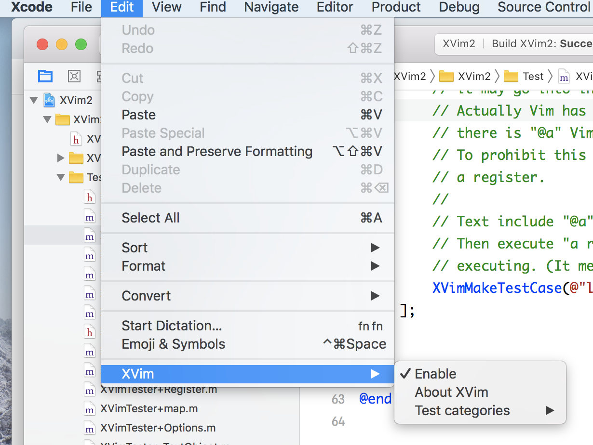

## Contributions
  Any suggestions, bug reports are welcome.  
  XVim2 depends highly Xcode's structure and Apple will modify Xcode's structure every year. So new feature requests depend on Xcode's structure are not recommended. 

  Please don't sumbit a pull request for a local language translation for maintenability.
  
### Debugging
  1. Open XVim2.xcodeproj by Xcode that we call it `First Xcode instance`.

  2. Select `Xcode` - `Edit scheme...` - `Run` - `Info` tab - `Executable` - `Ask on Launch`

  3. `Product` - `Run`

  4. Select `Xcode` app on `Choose an app to run:`
  
  5. You can see `Second Xcode instance` that is the application you can debug.  
     Also you see debug console log in the `First Xcode instance`.
     
### Debug with log
  1. In your ~/.xvimrc, add a line "set debug"
  2. You can use `tail -f ~/.xvimlog` command to see xvim debug log. 

### Run Unit Tests
  1. In your .xvimrc, add a line "set debug", which tells XVim to run in debug mode.
  2. Open XVim.xcodeproj, a debug instance of Xcode shows up.
  3. In the debug Xcode instance, create a random small disposable project (say HelloWorld.xcodeproj) if you have don't this already.
  4. Open HelloWorld.xcodeproj using debug Xcode instance.
  5. Go to XVim menu, there should be an item "test categories"
  6. Choose a category to run
  7. A separate window shows up and unit tests are run inside that window.
  8. Results will be shown when all the tests in that category are completed.

  
